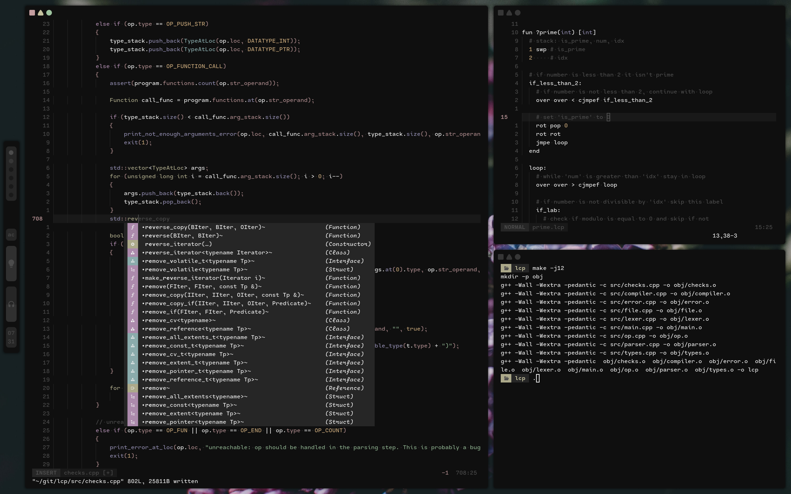

<h1 align="center">My Epic Dotfiles</h1>

 
	
	
	<!--  -->
	<!--  -->

 

 

My semi-decent linux configs for my computer.
- Window Manager: AwesomeWM
- Terminal: Alacritty
- Text Editor: Neovim

### Install Guide

Copy the `.config`, `.themes`, and `.local` folders into your home directory.
Run `fc-cache` to update all your fonts.
Also copy `.bashrc`, `.xinitrc`, and `.profile` into your home directory.
