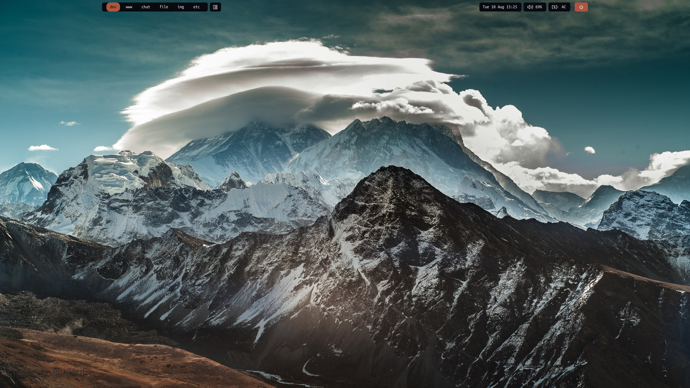
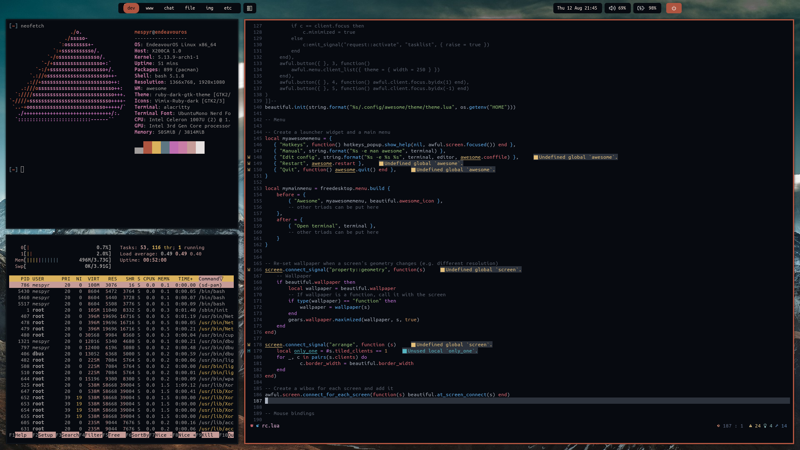

# OLD RICE FOR AWESOMEWM AND ALACRITTY

This is my old rice for the Awesome WM and my old Alacritty colorscheme.

### Screenshot

### Theming for GUI applications
[My GTK Theme](https://github.com/Mespyr/ruby-dark-gtk-theme) and [the Vimix Icon Theme](https://github.com/vinceliuice/vimix-icon-theme)

